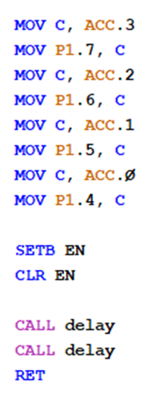
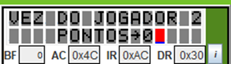

# Batalha Naval
Arquitetura de Computadores - CE4411
Kaynã de Deus - 22.123.096-4
## Descrição
O projeto é desenvolvido no simulador EdSim51 usando Assembly e consiste em um jogo de batalha naval, o tabuleiro 5x5 é gerado na memória RAM e um teclado é usado para que o programa receba a posição desejada.

## Fluxograma
 

## Funções
**Montagem do tabuleiro:** O tabuleiro é montado em uma matriz 5x5 na memória de dados, do endereço 020H até 064H, com 0 representando a água e 1 representando os navios. Variáveis para controle de jogadores e pontos também são inicializadas

**Entrada:** A coordenada que o usuário deseja testar é coletada usando o teclado do simulador, as teclas de linha (0-4) são lidas e armazenadas em R6, enquanto as teclas de coluna (5-9) são lidas e armazenadas em R7.

Coordenada da coluna subtraída por 5 para auxiliar na busca dentro do tabuleiro.

**Tiro na memória RAM:** Com a coordenada em mãos, a fórmula para encontrar o endereço correspondente na memória é:
END = Linha * 10H + 20H + (Coluna - 5)
O valor armazenado no endereço é então analisado, se for 0, o novo valor atribuído ao endereço é 02 para sinalizar um tiro errado, se for 1, o novo valor será 3 para sinalizar o acerto. 

Tiros nos endereços (1,7) e (2,9)

**Mensagens no display:** Sub-rotinas para configurar o display e armazenamento de Strings no endereço 0F00H.

**Mensagem de introdução:** Apresenta o programa e dá instruções pelo display.

**2 jogadores:** endereço 070h alterna entre 1 e 2 para controlar a vez do jogador e mostrar seus pontos (endereços 071h e 072h) no início de cada turno.
 

**Fim de turno:** Turno termina mostrando a coordenada e uma sub-rotina para alternar o jogador.

**Pontuação:** em caso de acerto, um ponto é incrementado ao endereço que corresponde ao jogador. É feita então a verificação de vitória (pontos = 3).
 

